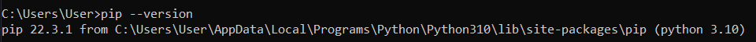

# Praktikum-11
### Pertemuan 15 : Python Library

#### Nama : Muhammad Ilham Sofyan Saifudin
#### NIM  : 312210297
#### Kelas: TI 22 A3
#### Apa itu PIP?
##### PIP merupakan program untuk manajemen paket di Python. Tugasnya untuk menginstal, menghapus, upgrade paket Python.Paket Pyhon merupakan sebuah modul yang berisi kode-kode python dan isi paket ini bisa kita impor ke dalam program kita.
#### Python PIP
* PIP bertugas untuk mengelola package dan modul pada python.
* Dengan menggunakan PIP, kita dapat menggunakan library yang tersedia bebas dari direktory package library python.
* Untuk dapat menggunakan PIP, kita bisa mengunjungi situs resmi PIP yaitu (https://pypi.org/project/pip)

#### Perintah Dasar PIP
* pip --version berfungsi untuk menampilkan versi PIP yang terinstall
* pip install nama_package berfungsi untuk menginstall package
* pip uninstall nama_package berfungsi untuk menghapus package
* pip list berfungsi untuk menampilkan daftar package yang terinstall
* Contoh:
* Menampilkan Versi PIP

* Menampilkan List Yang Terinstal

##### Sekian yang bisa saya sampaikan,mohon maaf bila ada kekurangan.Wassalamualaikum Warahmatullahi Wabarakatuh.